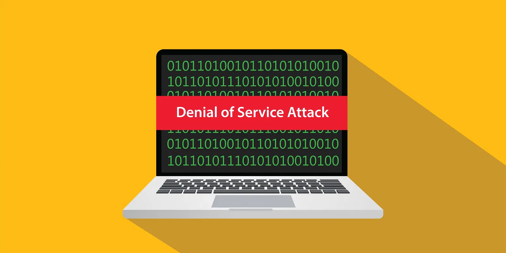

# [Denial Of Service](https://learnweb3.io/courses/c446d19f-a25d-42c6-b3e4-4311c5040587/lessons/4c29a79b-8538-4fa7-b42f-45aabbd76cac)

 

A Denial of Service (DOS) attack is a type of attack that is designed to disable, shut down, or disrupt a network, website, or service. Essentially it means that the attacker somehow can prevent regular users from accessing the network, website, or service therefore denying them service. This is a very common attack which we all know about in web2 as well but today we will try to immitate a Denial of Service attack on a smart contract

🤔 What is a DOS attack?

> It's an attack disable the service

🤔 What does DOS stand for?

> Denial Of Service

🤔 DOS attacks happen in?

> Both Web2 and Web3

🤔 Which one of the following is an example of DOS attack?

> Multiple requests sent to the server outside its capacity

🤔 Is this a valid example of DOS attack?

> Yes

🤔 Is this a valid example of DOS attack?

> No