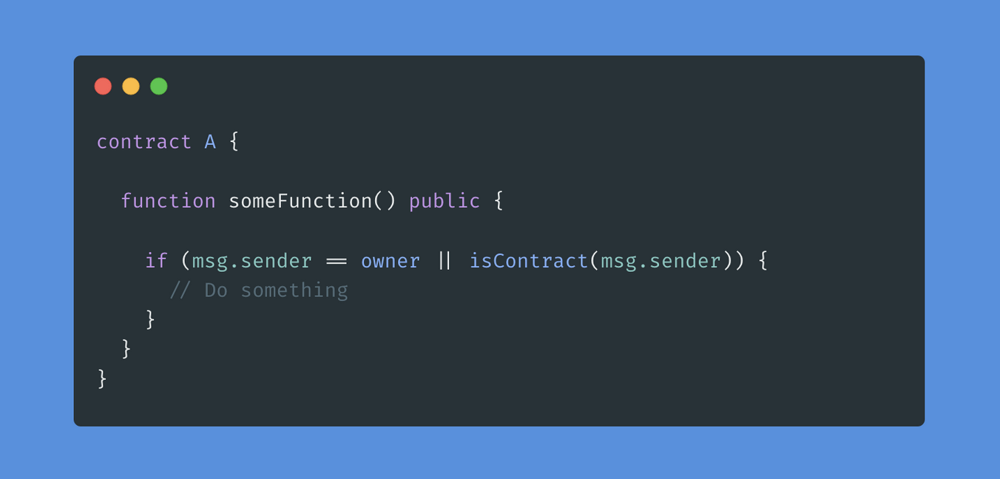

# [Gas Optimizations in Solidity](https://learnweb3.io/courses/c446d19f-a25d-42c6-b3e4-4311c5040587/lessons/00a46a95-0493-46bf-95cb-7a98e62109d8)

## Tips and Tricks

### Variable Packing

If you remember we talked about storage slots in one of our previous levels. Now the interesting point in solidity if you remember is that `each storage slot is 32 bytes`.

This storage can be optimized which will further mean gas optimization when you deploy your smart contract if you pack your variables correctly.

Packing your variables means that `you pack or put together variables of smaller size so that they collectively form 32 bytes`. For example, you can `pack 32 uint8 into one storage slot` but for that to happen it is important that you declare them `consecutively` because the order of declaration of variables matters in solidity.

Given two code samples:

```sh
uint8 num1;
uint256 num2;
uint8 num3;
uint8 num4;
uint8 num5;
```

```sh
uint8 num1;
uint8 num3;
uint8 num4;
uint8 num5;
uint256 num2;
```

`The second one` is better because in the second one solidity compiler will `put all the uint8's in one storage slot` but in `the first case` it will `put uint8 num1 in one slot` but now `the next one it will see is a uint256 which is in itself requires 32 bytes cause 256/8 bits = 32 bytes` so it can't be put in the same storage slot as uint8 num1 so now `it will require another storage slot`. 

After that `uint8 num3, num4, num5 will be put in another storage slot`. Thus the second example requires 2 storage slots as compared to the first example which requires 3 storage slots.

It's also important to note that elements in `memory` and `calldata` cannot be packed and are not optimized by solidity's compiler.

🤔 The Solidity compiler can pack variables regardless of their order?

> False

### Storage vs Memory

Changing `storage variables` requires more gas than `variables in memory`. It's better to `update storage variables at the end after all the logic has already been implemented`.

So given two samples of code

```sh
contract A {
    uint public counter = 0;
    
    function count() {
        for(uint i = 0; i < 10; i++) {
            counter++;
        }
    }
    
}
```

```sh
contract B {
    uint public counter = 0;
    
    function count() {
        uint copyCounter;
        for(uint i = 0; i < 10; i++) {
            copyCounter++;
        }
        counter = copyCounter;
    }
    
}
```

The second sample of code is `more gas optimized` because we are `only writing to the storage variable counter only once` as compared to the first sample where we were `writing to storage in every iteration`. 

Even though we are performing one extra write overall in the second code sample, the `10 writes to memory and 1 write to storage` is still cheaper than `10 writes directly to storage`.

🤔 Should you write to storage variables in a loop, or create a local copy and update the storage variable at the end even if it means having a higher number of total read/writes?

> Create a local copy in memory because the cost of additional write is still lower than writing to storage all the time

### Fixed length and Variable-length variables

We talked about how fixed length and variable length variables are stored. `Fixed-length variables are stored in a stack` whereas `variable-length variables are stored in a heap`.

Essentially why this happens is because in a stack you exactly know where to find a variable and its length whereas in a heap there is an extra cost of traversing given the variable nature of the variable

So if you can make your variables fixed size, it's always good for gas optimizations

Given two examples of code:

```sh
string public text = "Hello";
uint[] public arr;
```

```sh
bytes32 public text = "Hello";
uint[2] public arr;
```

The second example is more gas optimized because all the variables are of fixed length.

### External, Internal, and Public functions

Calling functions in solidity can be very gas-intensive, its better you call one function and extract all data from it than call multiple functions

Recall the `public` functions are those which can be called both `externally` (by users and other smart contracts) and `internally` (from another function in the same contract).

However, when your contract is creating functions that will only be called `externally` it means the contract itself can't call these functions, it's better you use the external keyword instead of public because `all the input variables in public functions are copied to memory which costs gas` whereas for `external functions input variables are stored in calldata` which is a special data location used to store function arguments and it `requires less gas to store in calldata than in memory`

The same principle applies as to why it's cheaper to call `internal` functions rather than `public` functions. This is because when you call internal functions `the arguments are passed as references of the variables` and `are not again copied into memory` but that doesn't happen in the case of public functions.

🤔 If your function is only ever going to be called by users and other smart contracts, what is the most gas efficient visibility modifier?

> external

### Function modifiers

Now even after moving a lot of the require statements in the modifier it wasn't helping because function `modifiers use the same stack as the function on which they are put`. To solve this issue we used an `internal` function inside the modifier because internal functions don't share the same restricted stack as the original function but modifier does.

🤔 Function modifiers use the same stack as the function they are attached to?

> True

🤔 What is the maximum number of local variables you can define within a single function?

> 16

### Use libraries

Libraries are `stateless contracts that don't store any state`. Now when you call a public function of a library from your contract, the bytecode of that function doesn't get deployed with your contract, and thus you can save some gas costs. To read more about libraries follow this [link](https://jeancvllr.medium.com/solidity-tutorial-all-about-libraries-762e5a3692f9).

 If you are writing your own libraries, you will need to deploy them and pay gas - but once deployed, it can be reused by other smart contracts without deploying it themselves. 

 ### Short Circuiting Conditionals

Since conditional checks will stop the second they find the first value which satisfies the condition, you should put the variables most likely to validate/invalidate the condition first.

In `OR conditions (||)`, try to put the variable with the highest likelihood of being `true` first, and in `AND conditions (&&)`, try to put the variable with the highest likelihood of being `false` first.

As soon as that variable is checked, the conditional can exit without needing to check the other values, thereby saving gas.

🤔 If `isContract` returns true when an address is a smart contract, and false otherwise - is this the best way to write the conditional for a contract that is often called by external contracts?



> it doesn't matter

### Free up Storage

Since storage space costs gas, you can actually free up storage and delete unnecessary data to get gas refunds. So if you no longer need some state values, use the `delete` keyword in Solidity for some gas refunds.

### Short Error Strings

Make sure that the error strings in your require statements are of very short length, the more the length of the string, the more gas it will cost.

```sh
require(counter >= 100, "NOT REACHED"); // Good
require(balance >= amount, "Counter is still to reach the value greater than or equal to 100, ............................................";
```

The first requirement is more gas optimized than the second one.


