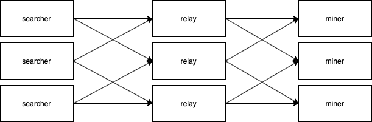

# [Maximal Extractable Value](https://learnweb3.io/courses/c446d19f-a25d-42c6-b3e4-4311c5040587/lessons/b3dbf8e4-f774-46c7-ae7f-72c5e75374bc)

MEV is a relatively new concept in the world of blockchains, and one that carries with it a lot of controversy. It refers to the maximum value that can be extracted from the block production apart from the standard block rewards.

Previously, it used to be called Miner Extractable Value, since miners were best positioned to extract value from block production, but as we move towards Proof of Stake and miners get replaced by validators, a more generic rename has been done to call it Maximal Extractable Value.

🤔 What does MEV stand for?

> Maximal Extractable Value
## What is MEV?

In a nutshell, it's the concept of extracting value (profit) by making certain types of transactions on chain that are not block rewards themselves. Originally, it started happening because miners had control over which transactions they'd like to include in a block, and in which order. Note that we are talking about miners right now but things will change after [the merge](https://ethereum.org/en/upgrades/merge/).

## MEV Extraction

In theory, MEV could only be extracted by miners, and this was true in the early days. Today, however, a large portion of MEV is extracted by independent network participants referred to as `Searchers`. 

🤔 What makes MEV possible?

> Miners can choose which transactions to include in a block in which order

## Searchers

`Searchers` are participants which are looking for opportunities to make profitable transactions. These are generally regular users, who can code of course. Miners get benefited from these `Searchers` because "Searchers" usually have to pay very high gas fees to actually be able to make a profitable transaction as the competition is very high. One example that we studied was `DEX Arbitrage` in our flash loan example.

This had led to the rise of research in the field of `Gas Golfing` - a fancy word for making minor optimizations to smart contracts and execution to try to minimize gas cost as much as possible, which allows Searchers to increase their gas price while lowering the gas fees thereby ending up with the same amount of total ETH paid for gas.


🤔 Why do searchers engage in doing gas golfing?

> Decreasing gas cost allows them to increase gas price while staying within budget for gas fees to make a profit

Searchers use the concept of `Gas Golfing` to be able to program transactions in such a way that they use the least amount of gas. This is because of the formulae `gas fees = gas price * gas used`. So if you decrease your `gas used`, you can increase your `gas price` to arrive at the same gas fees.

🤔 What role do Searchers play?

> Searchers run complex algorithms and bots to try to make profit on-chain

## Frontrunning

## Flashbots

🤔 Why do miners choose to run the Flashbots software?

> Because they cannot keep track of all MEV opportunities alone


🤔 Today, most of the MEV is extracted by?

> Searchers

## Use cases of MEV and Flashbots

### Liquidations

Similarly, when the borrower gets liquidated, some part of their collateral goes to the lender which includes interest and the borrowed money. Along with that the borrower also `has to pay a liquidation fee which goes to the user/bot which started the liquidation transaction.`

`Searchers` run algorithms to keep track of borrowers on various lending protocols to detect if someone can be liquidated. If they find an opportunity to liquidate someone, they can extract MEV from that opportunity by `being the first to get their liquidation transaction mined therefore earning the liquidating fees.`

### Sandwich Attacks

1. Searcher sells a lot of `Token A` for `Token B`, driving down the price of `Token A` and driving up the price of `Token B`
2. User's transaction goes through, which also sells a lot of `Token A` for `Token B`, but receives less `Token B` than originally anticipated. This further drives down `Token A` price and increases `Token B` price.
3. Searcher sells back their `Token B` for `Token A`, ending up with more `Token A` than they started off with, making a profit.

Since searchers add two transactions to the block right before and after the user's large trade, it is called a Sandwich Attack.

### Recovering funds from compromised accounts

🤔 What is an example of an MEV opportunity?

> Liquidations on AAVE

> Trading on Uniswap

> Minting the next blue chip NFT

> All of the above

## The good and the bad

🤔 Why are frontrunning bots not common anymore?

> Because most MEV goes through Flashbots today which skips the public mempool

## Architecture of Flash bots



🤔 Flashbots Relay is currently centralized?

> True

### eth_sendBundle

Flashbots introduced a new `eth_sendBundle` RPC which is a standard format to interact with the flashbot relayers and miners. It includes array of arbitrary signed Ethereum transactions along with some metadata

Here is a list of all the params it takes:

```sh
{
  "jsonrpc": "2.0",
  "id": 1,
  "method": "eth_sendBundle",
  "params": [
    {
      txs,               // Array[String], A list of signed transactions to execute in an atomic bundle
      blockNumber,       // String, a hex encoded block number for which this bundle is valid on
      minTimestamp,      // (Optional) Number, the minimum timestamp for which this bundle is valid, in seconds since the unix epoch
      maxTimestamp,      // (Optional) Number, the maximum timestamp for which this bundle is valid, in seconds since the unix epoch
      revertingTxHashes, // (Optional) Array[String], A list of tx hashes that are allowed to revert
    }
  ]
}
```

🤔 What is the new RPC call introduced by Flashbots?

> eth_sendBundle

## Explorer

To view how MEV is progressing over the years, the flashbot team has built an explorer. Do check it out, it's amazing. Follow this [link](https://explore.flashbots.net/)

## Example of MEV

A real world arbitrage MEV [transaction](https://etherscan.io/tx/0x2bde6e654eb93c990ae5b50a75ce66ef89ea77fb05836d7f347a8409f141599f)

---

Right now most of the flashbots work is still in the research and early phases. But as we all can understand, it has a lot of potentials.

Web3 is full of potential and we are just getting started 🚀 👀

Just wow 🤯

## Recommended Readings

- [Ethereum is a Dark Forest](https://www.paradigm.xyz/2020/08/ethereum-is-a-dark-forest)

- [Escaping the Dark Forest](https://samczsun.com/escaping-the-dark-forest/)

## References

- [Ethereum.org docs](https://ethereum.org/en/developers/docs/mev/)

- [Flashbots docs](https://docs.flashbots.net/flashbots-auction/overview)