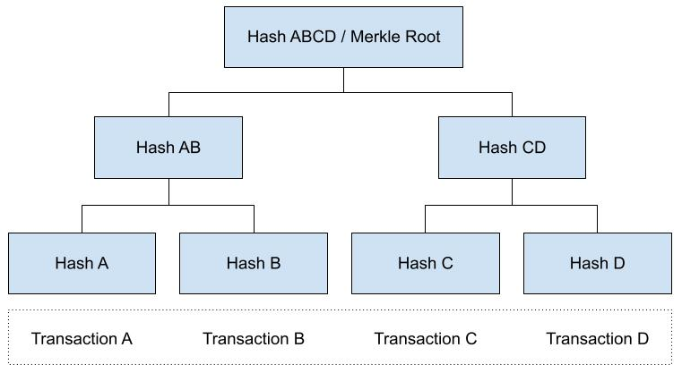
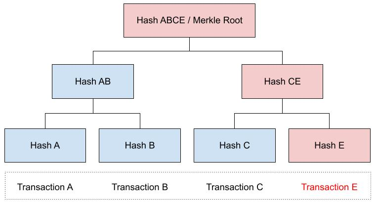

## 1. [Merkle Trees](https://www.learnweb3.io/tracks/senior/merkle-trees)

Merkle Trees are a fundamental concept in blockchain technology. They're a special kind of binary tree which is used to encode large chunks of information. The cool thing about Merkle Trees is that they kind of 'build up' from the bottom-up, and allow you to verify if some value is present in the tree or not without having to loop over every element of the tree. This can be quite useful, as we will see. 🧐

### What is a Merkle Tree?
A Merkle tree is a type of hash tree in which each leaf node is labeled with the cryptographic hash of a data block, and each non-leaf node is labeled with the cryptographic hash of its child nodes' labels. The majority of hash tree implementations are binary (each node has two child nodes), but they can also have many more child nodes.

A typical Merkle Tree looks something like this:


### Simple Example

Let's say we have 4 transactions: "Transaction A", B, C and D. All of them are executed in the same block. Each of these transactions is going to get hashed. Let's call those hashes "Hash A", B, C, and D respectively.

The following would be the resulting Merkle Tree of these transactions:



### Verifying Validity using the Merkle Root

When these transactions get rolled up into a block, the block header would contain the Merkle Root, Hash ABCD. All miners have a copy of all transactions so far, and therefore all the transaction hashes. Any miner can rebuild the Merkle tree on-demand, which means that every miner can independently arrive at the same Merkle root for the same set of transactions.

This allows any miner to verify a fraudulent transaction. Let's say someone tries to introduce a false transaction instead of Transaction D. Let's call this Transaction E. Because this transaction is different from Transaction D, the hash is going to be different as well. The hash of Transaction E is Hash E. The Hash of C and E together is Hash CE, which is different from Hash CD. When Hash AB and CE are hashed together, you get Hash ABCE. Since hash ABCE is different from Hash ABCD, we can conclude that Transaction E is fraudulent.



A miner can recompute the Merkle Root in their own block and try to publish that version to the blockchain, but since every other miner has a different Merkle Root, the fraudulent miner is easily rejected.

### Install merkletreejs
```sh
npm install @openzeppelin/contracts keccak256 merkletreejs
```