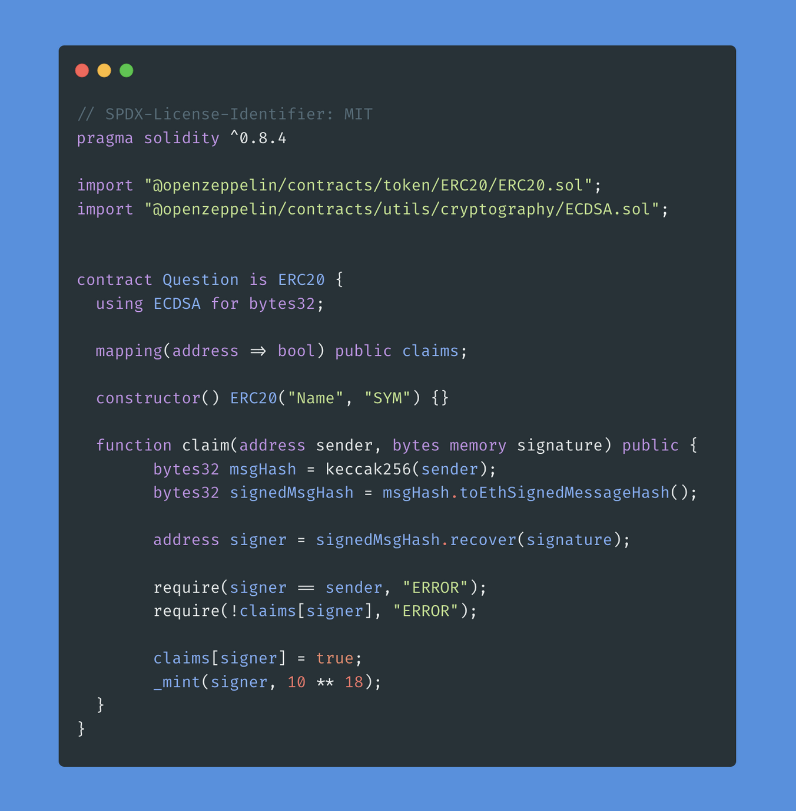

# [Metatransactions and Signature Replay](https://learnweb3.io/courses/c446d19f-a25d-42c6-b3e4-4311c5040587/lessons/f9ab29e4-725d-4b9d-8d54-a372c582d01d)

There are times when you want `your dApp users to have a gas-less experience`, or perhaps `make a transaction without actually putting something on the chain`. These types of transactions are called `meta-transactions`, and in this level, we will dive deep into how to design meta-transactions and also how they can be exploited if not designed carefully.

For those of you who have used OpenSea, ever noticed how OpenSea `lets you make listings of your NFT for free`? No matter what price you want to sell your NFT at, somehow `it never charges gas beyond the initial NFT Approval transaction`? The answer, **Meta transactions**.

Meta transactions are also commonly used for `gas-less transaction experiences`, for example asking the users to `sign a message to claim an NFT`, instead of paying gas to send a transaction to claim an NFT.

🤔 Which of the following is NOT a valid use case for Meta Transactions?

> Guaranteeing your transaction will be included in the next block

🤔 What role does a relayer play in the context of metatransactions?

> Relayer pays the gas for transactions initiated by the users through a signature

🤔 What are digital signatures used for?

> Ensuring data integrity and proof that a certain person sent that message

🤔 Which digital signatures algorithm does Ethereum use?

> ECDSA

🤔 What is uint256's max value in hexadecimal?

> 0xffffffffffffffffffffffffffffffffffffffffffffffffffffffffffffffff

🤔 Why is signature replay a problem?

> Signature replay can make it seem like the user gave permission for something they did not

🤔 Is this contract vulnerable to Signature Replay?

> No