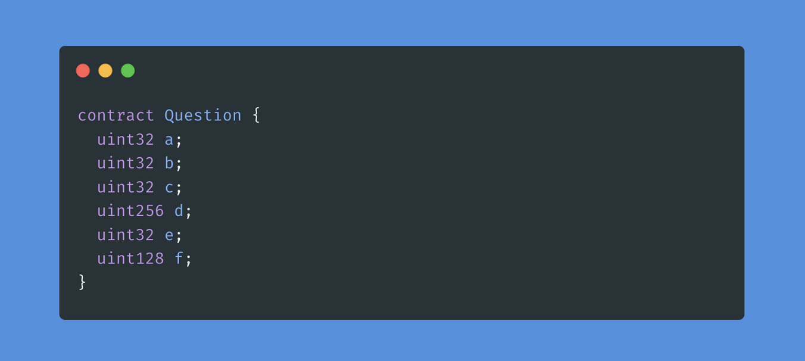

[Private data](https://www.learnweb3.io/tracks/senior/private-data)

## Accessing private data

When we start writing smart contracts and come across visibility modifiers like public, private, etc. we may think that if you want some variable's value to be readable by the public you need to declare it public, and that private variables cannot be read by anyone but the smart contract itself.

But, Ethereum is a public blockchain. So what does private data even mean?

## What does `private` mean?

Function (and variable) visibility modifiers only affect the visibility of the function - and do not prevent access to their values. We know that **public** functions are those which can be called both externally by users and smart contracts, and also by the smart contract itself.

Similarly, **internal** functions are those which can only be called by the smart contract itself, and outside users and smart contracts cannot call those functions. **external** functions are the opposite, where they can only be called by external users and smart contracts, but not the smart contract that has the function itself.

**private**, similarly, just affects who can call that function. **private** and **internal** behave mostly similarly, except the fact that **internal** functions are also callable by derived contracts, whereas private functions are not.

So for example, if **Contract A** has a function **f()** which is marked **internal**, a second **Contract B** which inherits **Contract A** like

```sh
contract B is A {
  ...
}
```

can still call **f()**.

However, if **Contract A** has a function **g()** which is marked **private**, **Contract B** cannot call **g()** even if it inherits from **A**.

The same is true for variables, as variables are basically just functions. private variables can only be accessed and modified by the smart contract itself, not even derived contracts. However, this does not mean that external parties cannot read the value.

> It is safe to store private information on-chain? => No

## BUIDL

To understand how this works, recall from the Ethereum Storage and Execution level that variables in Solidity are stored in **32 byte (256 bit) storage slots**, and that data is stored sequentially in these storage slots based on the order in which these variables are declared.

Storage is also optimized such that **if a bunch of variables can fit in one slot, they are put in the same slot**. This is called variable packing, and we will learn more about this later.

```sh
// SPDX-License-Identifier: MIT
pragma solidity ^0.8.4;

contract Login {

    // Private variables
    // Each bytes32 variable would occupy one slot
    // because bytes32 variable has 256 bits(32*8)
    // which is the size of one slot

    // Slot 0
    bytes32 private username;
    // Slot 1
    bytes32 private password;

    constructor(bytes32  _username, bytes32  _password) {
        username = _username;
        password = _password;
    }
}
```

> How many storage slots will be used for this contract?

 

=> 3

Therefore, instead of attempting to read these variable values by calling the contract, which is not possible, **we can just access the storage slots directly**. Since Ethereum is a public blockchain, all nodes have access to all the state.

