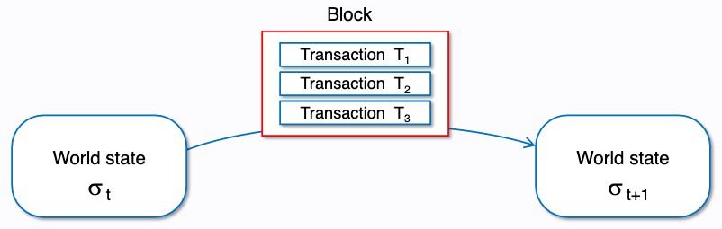

[Storage and Execution](https://www.learnweb3.io/tracks/senior/eth-data-storage-execution)

# Ethereum Storage and Execution

We have been writing smart contracts over the last few tracks, and briefly mentioned that Ethereum smart contracts run within this thing called the Ethereum Virtual Machine (EVM).

## Recap

Recall that Ethereum works as a transaction-based state machine. Starting at some state s1, a transaction manipulates certain data to shift the world state to some state s2.

To group things together, transactions are packed together in blocks. Generally speaking, each block changes the world state from state s1 to s2, and the conversion is calculated based on the state changes made by every transaction within the block.

When we think of these state changes, Ethereum can be thought of as a state chain.

But, what is this world state? 🤨

## World state

The World State in Ethereum is a mapping between addresses and account states. Each address on Ethereum has it's own state, this could be a user account (EOA - Externally owned accounts) or a smart contract.

Each block essentially manipulates multiple account states, thereby manipulating the overall world state of Ethereum.

## Account State

Alright, so the world state is comprised of various account states. What is an account state?

The account state contains a few common things, like the nonce and the balance (in ETH). Additionally, smart contracts also contain a storage hash and a code hash. The two hashes act as references to a separate state tree, which store state variables and the bytecode of the smart contract respectively.

Recall that there are two types of accounts in Ethereum. Externally owned accounts (e.g. Coinbase Wallets, Metamask Wallets, etc.) and Smart Contract Accounts.

EOA's are controlled by private keys, and do not have any EVM code. Contract accounts on the other hand contain EVM code and are controlled by the code itself, and do not have private keys associated with them.