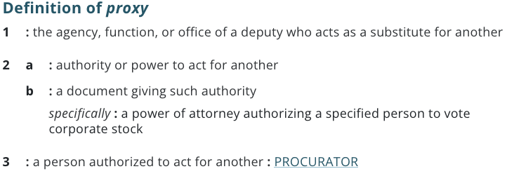
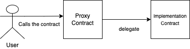

[Upgradeable Contracts and Patterns](https://learnweb3.io/courses/c446d19f-a25d-42c6-b3e4-4311c5040587/lessons/aecdab9d-4ace-4458-b2a1-a50745d79678)

We know that smart contracts on Ethereum are not upgradeable, as the code is immutable and cannot be changed once it is deployed. But writing perfect code the first time around is hard, and as humans we are all prone to making mistakes. Sometimes even contracts which have been audited turn out to have bugs that cost them millions.

🤔 You cannot upgrade a smart contract's code itself

> True

In this level, we will learn about some design patterns that can be used in Solidity to write upgradeable smart contracts.

## How does it work?

To upgrade our contracts we use something called the `Proxy Pattern`. The word `Proxy` might sound very familiar to you because it is not a web3-native word.



Essentially how this pattern works is that a contract is split into two contracts - `Proxy Contract` and the `Implementation` contract.

The `Proxy Contract` is responsible for managing the state of the contract which involves persistent storage whereas `Implementation Contract` is responsible for executing the logic and doesn't store any persistent state. User calls the `Proxy Contract` which further does a `delegatecall` to the `Implementation Contract` so that it can implement the logic. Remember we studied `delegatecall` in one of our previous levels 👀



```sh
npm i @openzeppelin/contracts-upgradeable @openzeppelin/hardhat-upgrades @nomiclabs/hardhat-etherscan --save-dev
```


